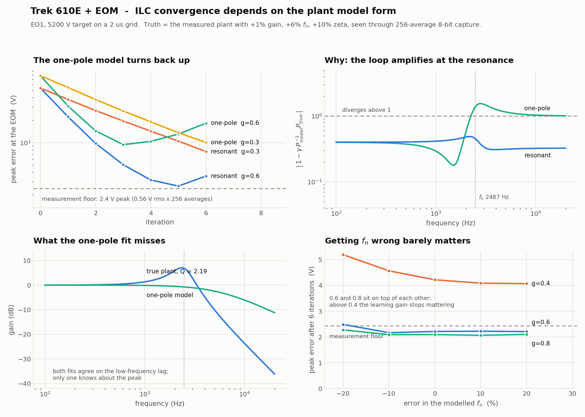

# EOM-ILC — pre-distortion and iterative learning control for the Trek / EOM ramp drive

Corrects the tracking error of the Trek 610E → EOM chain by reshaping the drive
waveform. Model-based pre-distortion does most of the work in one shot;
iterative learning control (ILC) cleans up what the model misses.

Built around the two bench programs that already exist —
[scope-grab](https://github.com/Weiss-Quantum-Computing/scope-grab) and
[BK4063B-AWG-GUI](https://github.com/Weiss-Quantum-Computing/BK4063B-AWG-GUI) —
whose instrument layers this imports rather than reimplementing, so there is no
second copy of SCPI to keep in step.

## The plant is second order

This is the thing to know before anything else. The Trek 610E + EOM is a lightly
damped resonance, **ζ ≈ 0.21, fₙ 2.2–3.0 kHz**, measured across a 0.05–19.2 Vpp
sweep. A one-pole fit of the same data returns τ ≈ 28 µs, which is exactly the
resonance's group delay `2ζ/ωₙ` — it gets the lag right and knows nothing about
the Q = 2.4 peak.

That is not a cosmetic distinction. ILC contracts only where
`|1 − γ·P⁻¹model·Ptrue| < 1`, and with a one-pole model at γ = 0.6 that factor is
**1.51 at 2326 Hz**. The loop bottoms out around iteration 3 and then climbs,
which on the bench reads exactly like plant drift:

```
                            i0      i1      i2      i3      i4      i5      i6
resonant  gamma=0.6       58.6    25.8    12.0     7.0     4.8     5.0     4.3
one_pole  gamma=0.6       84.3    33.9    16.5    11.9    13.5    16.8    23.5  <-- diverging
```

Peak error in volts at the EOM, against the measured plant perturbed by +1% gain,
+6% fₙ and +10% ζ, with 256-average scope noise. Reproduce the numbers with
`simulate.py --target waveforms/target_MKJX1.csv`, or the figure below with
`make_validation_fig.py`.



Note the floor those curves flatten onto is a **peak** quantity: 256 averages of
a 31 mV LSB give 0.56 V rms, but the peak of 5301 samples of that noise is 2.4 V.
A converged trace sitting at 2.4 V peak is at the measurement floor, not above it.

Seed with `fn`/`zeta` via `Channel.plant()`, never with `tau`. Gain accuracy is
what dominates the first shot — the 1% gain error alone is 55 V of that 58.6 —
while a ±20% error in fₙ barely moves the final result.

## Layout

| | |
|---|---|
| `eomilc/` | the library: `config` (calibration), `plant` (models + fitting), `ilc` (the loop), `outputs` (file emission), `scope` (capture reader) |
| `run_ilc.py` | manual driver — `init` / `step` / `emit-ni` |
| `ilc_bench.py` | closed-loop driver, upload → capture → update with no hands |
| `make_target.py` | build a target from the MKJ waveform at any peak and grid |
| `simulate.py` | validate the loop off the bench |
| `characterisation/` | the 2026-08-21 analysis that produced every constant in `config.py` |
| `waveforms/` | the current targets and iteration-0 drives |
| `WORKFLOW.md` | **the bench procedure** — read this before touching hardware |
| `MKJ_FULL_NOTES.md` | what the MKJ waveform is, headroom arithmetic, DDS behaviour |

Needs `numpy`, `scipy`, `pandas`, and `pyvisa` for the bench drivers. On the lab
PC that means the Anaconda interpreter, `C:\ProgramData\anaconda3\python.exe` —
it is the only one there with all four.

## Quick start

```bash
python make_target.py --channel EO1 --peak-hv 5200 --step 2 --out waveforms/target_MKJX1.csv
python run_ilc.py init --target waveforms/target_MKJX1.csv --channel EO1 --name MKJX1
# play drive_MKJX1_iter0_awg.csv, capture >=256 averages, then:
python run_ilc.py step --state drive_MKJX1.state.npz --measured "MKJX1_i00*.csv" \
       --mon-col CH3 --t-offset <measured once>
```

## Calibration lives in `eomilc/config.py`

Measured 2026-08-20/21 — **update these when the hardware changes.**

| | EO1 | EO2 |
|---|---|---|
| divider (AWG → Trek in) | 0.6254 ± 0.0038 | 0.6103 ± 0.0037 |
| Trek in → monitor | **0.8926** ← see below | 1.0011 ✓ |
| fₙ at full scale | 2326 Hz | 2207 Hz |
| ζ at full scale | 0.206 | 0.209 |
| noise at Trek input | 144 µV rms | 624 µV rms |
| fine trim channel | none | 1:100 op-amp summer |

**The 12% Trek mismatch.** EO1's monitor-over-input is 0.8926 where EO2's is
1.0011. Reaching a 90° rotation needs more analog-card voltage on X1 than X2,
which is what you would see if the *amplifier gain* were low (≈896 V/V) and the
monitor divider were honest — rather than the gain being right and the monitor
reading low. Those two cases are distinguished by reading the monitor at the 90°
point: equal on both channels means low gain, X1 low means a bad monitor.

If the monitor is honest, ILC closes the loop on true HV and absorbs the
difference automatically; it just shows up as more drive on X1. Worth checking
the 610E front-panel gain setting on both units and swapping the amplifiers
between channels to see whether the 12% follows the box.

**`LIMITS.load_capacitance` defaults to 200 pF and is a guess.** Measure the real
EOM + cable capacitance and set it, or the current guard means nothing.

## Things that will bite you

**Waveform names: 11 characters.** The generator stores an upload as
`<name>.bin` and the limit is on the stored name — 15 accepted, 16 not. Past it
nothing is refused: the upload lands, the right shape comes out, and then the
front panel wedges until you power cycle it. The loop appends `_i00`, so the stem
gets 7. `ilc_bench.py` reads the cap from the GUI's own `MAX_ARB_NAME`.

**Upload the `_awg.csv`, not the drive file.** With the GUI's Normalise off it
expects samples already in ±1 and clips past it; with it on it divides by the
record's own peak, which silently rescales the correction the loop just computed.
`write_bk_waveform` emits a single-column file already scaled against a fixed
±10 V, which sidesteps both.

**Time alignment.** `--t-offset` is the fixed trigger-to-waveform delay. Measure
it once and leave it alone. Re-fitted per iteration, the loop chases its own
alignment and stops converging.

**Averaging.** A single 8-bit trace has an LSB worth ~31 mV on the monitor — 31 V
at the EOM. 256 averages puts the floor near 5 V; 1024 gets you to 2.5 V. Below
that you need a higher-resolution scope, not more averages.

**The Q filter.** `--f-cut` (default 20 kHz) keeps ILC from learning noise. Do
**not** lower it to cure divergence — it filters the whole drive, not just the
update, so dropping it near fₙ destroys the pre-distortion. Fix the model instead.

**`--zero-baseline` is off by default** and must stay off for any waveform already
moving in the first 5% of the record. MKJ is, and enabling it there subtracts
~130 V of real signal and roughly doubles the reported error.

## Provenance

`characterisation/` holds the scripts, fits and figures behind every number in
`config.py`, from 40 captures taken 2026-08-20/21. The raw captures themselves
(~260 MB) are not in the repository; point `EOM_RAMPS_DIR` at them to re-run.
`characterisation/results2.json` is the direct source of the `fn_pts` / `zeta_pts`
tables.
