# Trek–EOM Ramp Correction

*Weiss Quantum Computing · EOM drive bench · 24–25 August 2026*

Over two bench days — on top of characterization work from the week before —
the high-voltage ramp drive went from 2.4% tracking error to below 0.05%. Three
things had to change, in order: the measurement (an 8-bit scope had been
feeding the loop its own quantization), the correction loop itself (iterative
learning against a parametric model, which converged and then stalled), and
finally the model (replaced by the amplifier's own measured frequency
response). The sections below follow that logic — loop first, then measurement,
then models — which is close to, but not exactly, the order it happened on the
bench.

| **126 → 2.4 V** | **0.046%** | **0.009% / 0.006%** | **53×** |
|:---|:---|:---|:---|
| peak error, 5.2 kV ramp | end-of-campaign peak error, both channels | end-of-campaign rms error, X1 / X2 | peak-error reduction |

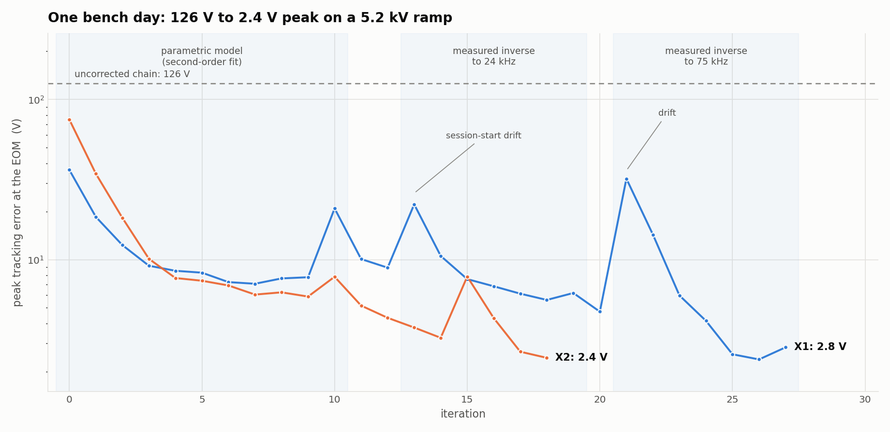

***The campaign in one chart.** Peak tracking error per iteration for both
channels, on the from-scratch automated runs. Three eras: the parametric
second-order model converges to a ~7 V floor; the measured inverse (to 24 kHz)
breaks through the floor the model could not; extending the inverse to 75 kHz
claimed most of what remained. The spikes are session-start drift — the chain's
dynamics wander on hour scales, and each new session opens 15–30 V off before
the loop re-converges in two or three iterations. Era bands follow X1's
iteration numbering; X2's inverse era began at its own iteration 10.*

## 1. The system and the problem

Each of the two channels (X1, X2) drives an electro-optic modulator through the
same chain: an arbitrary waveform generator (B&K 4063B), a passive
preconditioning network (a divider on X1; a 1:100 coarse/fine summer on X2),
and a Trek 610E high-voltage amplifier with a nominal gain of 1000. The Trek's
monitor output reports the high voltage divided by 1000, so a monitor volt is
numerically an input volt, and everything in this report is quoted in *volts at
the EOM* — monitor volts × 1000.

```
AWG (B&K 4063B, ±10 V, burst @ 20 Hz)
  → preconditioning (÷0.63 divider; X2 adds a 1:100 coarse/fine summer)
  → Trek 610E (×1000, ±10 kV) → EOM
       └─ monitor = HV/1000 → scope (MSO-X 2014A, 8-bit)
```

The commanded waveform is a 10.602 ms burst — a smoothed up-leg, a ~1.2 ms hold
at 5.2 kV, and a time-reversed down-leg — played on a 5301-point, 2 µs grid,
triggered externally at 20 Hz. Driven open-loop with a scaled copy of the
target, the chain tracks to about **126 V peak / 46 V rms (2.4% / 0.9%)**: the
amplifier lags, the corners overshoot, and the two channels need different
drive amplitudes for the same output (the Treks' gains differ by 12%).

The correction strategy is **iterative learning control** (ILC): play the
drive, measure the monitor, compute a correction from the error, upload the
corrected drive, repeat. Nothing about the strategy is exotic — most of what
was difficult in this campaign lived in two places: *measuring the error
honestly* (§3) and *knowing the amplifier well enough to convert error into
correction* (§4–5). The loop itself comes first (§2), because its one-line
convergence condition is the lens every later failure is read through.

## 2. The iteration, in the simplest case

Model the chain as a gain and a single pole — a first-order lag:

$$
P(s) = \frac{g}{1 + \tau s} \qquad \text{(plant)}
$$

- **s** — the Laplace variable; on real signals read s = j2πf with f in Hz.
- **t** — time within the burst.
- **v\*(t)** — the target waveform in monitor volts (×1000 = volts at the EOM).
- **y_k(t)** — the measured monitor on iteration k.
- **e_k = v\* − y_k** — the tracking error.
- **u_k(t)** — the drive record, in volts at the AWG.
- **g** — the DC gain from AWG to monitor (≈0.56 on X1, 0.61 on X2).
- **τ** — the lag time constant (≈28 µs).

If the drive were simply the target divided by the gain, the output would lag
by τ — about 30 V of error on the fast parts of the ramp. The exact inverse of
this model says how to pre-distort: boost the drive in proportion to the
target's slope,

$$
u_0(t) = \frac{v^*(t) + \tau\,\dot v^*(t)}{g} \qquad \text{(model inverse — the first shot)}
$$

That is the *first shot*. It is only as good as the model, so the loop then
iterates on the measured error:

$$
u_{k+1} = Q\left[\,u_k + \gamma\,L(e_k)\,\right] \qquad \text{(update law)}
$$

- **L(·)** — the model inverse applied to the error (for the one-pole model,
  L(e) = (e + τė)/g).
- **γ** — the learning gain, 0.6 throughout this work: the fraction of the
  computed correction actually applied per iteration.
- **Q** — the Q-filter: a 4th-order Butterworth low-pass with corner f_cut,
  applied forward and backward over the record (`filtfilt`), so it is
  zero-phase and its magnitude is the Butterworth response squared:
  |Q(f)| = 1/[1+(f/f_cut)⁸]. It confines learning to frequencies where the
  model — and the measurement — are trusted.

Because the plant is linear, each frequency component of the error evolves
independently, and one line tells you everything about convergence. Writing
E_k(f) for the Fourier transform of the error at iteration k:

$$
E_{k+1}(f) = \left[\,1 - \gamma\,L(f)\,P_{\mathrm{true}}(f)\,\right] E_k(f) \qquad \text{(contraction)}
$$

If the model were exact, L·P_true = 1 and the error shrinks by (1−γ) per
iteration at every frequency. When the model is wrong the bracket grows, and
wherever |1 − γLP_true| > 1 the loop doesn't merely stall — it **amplifies**
its own correction, iteration after iteration.

So the update has two inputs it cannot do without: an error measurement that is
signal rather than artifact, and an L that matches the real chain. The first is
§3; the second is §4 and §5.

## 3. Seeing a 2 V error on a 5,200 V ramp

The scope digitizes 8 bits over 8 divisions. At the 1 V/div needed to see the
whole monitor waveform, one code is **40 mV — 40 V at the EOM**. A single
capture cannot resolve errors much below half a code, and worse, the
quantization error is not noise: on the slow parts of the ramp the trace crawls
across each code, producing a deterministic ±20 V sawtooth. Fed to the update
law, that sawtooth is indistinguishable from tracking error — the loop will
learn it into the drive.

### The ladder of capture schemes

Averaging *N* sweeps reduces random noise as 1/√N, but it only removes
quantization where analog noise dithers the trace across a code boundary. Three
rungs were climbed in sequence:

- **Hardware averaging (AVER 256) + 16-bit WORD readback.** The averaged record
  is stored deeper than the 8-bit display; WORD readback recovers 2.5 mV steps
  — but that 2.5 mV is a hard 12-bit delivery lattice of the instrument,
  identical at any average depth and in HRES mode. A lattice is still a
  systematic, deterministic error.
- **64 single HRES shots, averaged in software.** Each HRES shot (the scope's
  internal high-resolution boxcar of its 2 GSa/s stream) carries the same
  2.5 mV lattice *plus 3.5 mV rms of per-shot analog noise*. Noise larger than
  the lattice step is precisely the dither condition: the mean of 64 shots
  walks off the lattice (steps of 0.157 mV measured — the WORD format floor)
  while random noise falls to ~0.4 mV. This is the scheme behind every
  measurement in this report: floor ≈ 0.5–1 V at the EOM, ~25 s per iteration
  at the 20 Hz trigger.
- **Alternatives considered and why they lose here:** lowering V/div shrinks
  the code but the full 5.2 V monitor swing must stay on screen, capping the
  gain at ~1.4×; a hardware error measurement (subtracting the commanded shape
  before digitizing) would be the right instrument but doesn't exist on this
  bench; deliberate sub-code dither injected by the AWG between captures would
  substitute for the analog noise, but the chain's own noise turned out
  sufficient; a deeper digitizer solves it by fiat, with money.

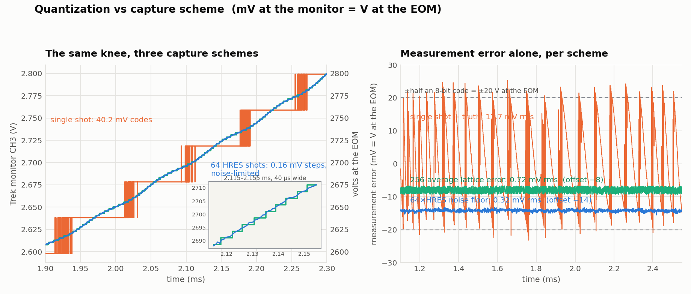

***Three capture schemes on the same knee of the ramp.** Left: the single 8-bit
sweep is a 40 mV staircase; the 64-shot HRES software average (blue) resolves
the ramp continuously; the inset (40 µs) shows the 256-average's 2.5 mV word
lattice — green steps — against the HRES continuum. Right, the comparison that
matters: measurement error alone, each scheme against the best truth estimate.
The single sweep hands the loop a ±20 V sawtooth (11.7 mV rms); the 256-average
leaves a 0.72 mV rms lattice error; the 64-shot HRES scheme reaches
**0.32 mV rms with no lattice structure resolvable** — 2.3× below the hardware
average, and free of the lattice's deterministic component down to the 0.157 mV
WORD floor. Two caveats on that number: it comes from a split-half comparison,
which bounds the random floor but would not reveal a systematic common to both
halves; and the lattice trace is reconstructed at its measured 2.5126 mV pitch,
the original averaged capture files having been pruned from disk during
cleanup.*

### Conditioning after capture — what helps and what cannot

Three conditioning steps are applied to measured data, all after capture:
resampling onto the 2 µs waveform grid boxcar-averages any finer-grained
samples; the 64 traces are averaged per-iteration; and the error is passed
through the zero-phase Q-filter of §2 before the correction is computed. What
deliberately was *not* attempted is smoothing away the staircase of an
unaveraged capture: a low-pass hides the steps but preserves their in-band
content — the sawtooth's power below the filter corner remains in the error
signal, is treated as real, and gets corrected into the drive. Information
destroyed by a quantizer is not recoverable from one record; it is only
recoverable across records, via dither and averaging. That distinction is the
defense of the measurement scheme.

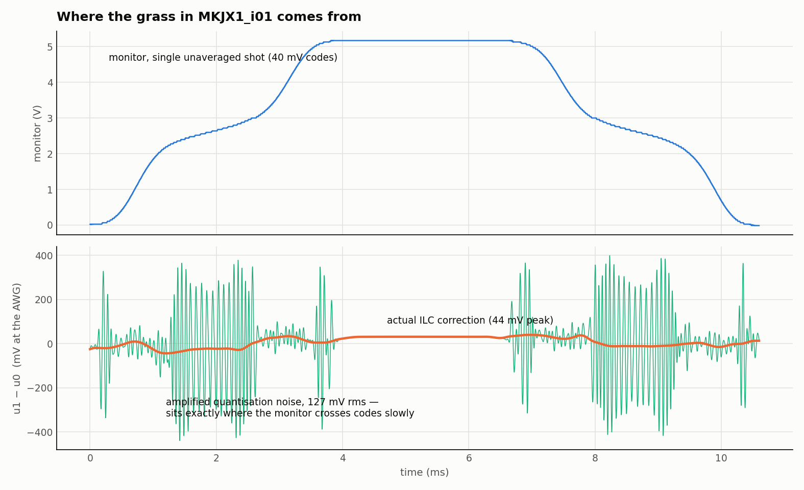

***What happens when the loop is fed quantization.** The first bench iteration
ran on a single unaveraged capture (an instrument trap, §7). Top: the monitor
staircase. Bottom: the computed drive correction — the real 44 mV correction
buried under 127 mV rms of high-frequency "grass". The amplification is the
work of the parametric inverse's derivative terms (§4), which boost exactly the
staircase edges; the grass bursts sit where the monitor crosses codes slowly.
Measurement quality, model choice, and Q-filtering are one coupled decision:
the filter corner must exclude the band where the error signal is measurement
artifact, and the artifact level decides how much band survives.*

## 4. The second-order model and its failure band

The chain had been characterized from ramp-response fits as a lightly damped
second-order system — damping ratio ζ ≈ 0.21, natural frequency
fₙ ≈ 2.3–3.0 kHz (ωₙ = 2πfₙ), quality factor 1/2ζ ≈ 2.4:

$$
P(s) = \frac{g\,\omega_n^2}{s^2 + 2\zeta\omega_n s + \omega_n^2} \qquad \text{(resonant plant)}
$$

$$
u = \frac{v^* + (2\zeta/\omega_n)\,\dot v^* + \ddot v^*/\omega_n^2}{g} \qquad \text{(its inverse)}
$$

The figure below makes the two practical consequences concrete. The inverse
differentiates *twice*: content in the error at frequency f is amplified by
(f/fₙ)² — a factor ~70 at 20 kHz — which is why §3's measurement floor and the
Q-filter corner are part of the same decision, and why the error is low-passed
before the lead ever sees it. And the one-pole model of §2 is secretly a
special case of this one: its τ equals the resonance's group delay 2ζ/ωₙ to
within 1.5%, so it reproduces the lag while knowing nothing of the peak.

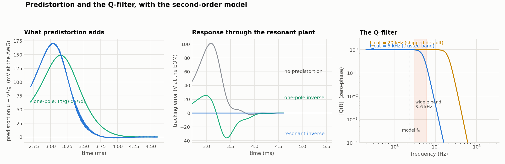

***Predistortion made visible.** Left: what each inverse adds to the plain
scaled drive on the upper knee — the one-pole lead is a slope-proportional
boost; the resonant inverse adds the curvature kick (its fuzz is the double
derivative amplifying the target's own 2 µs grid — the noise-sensitivity of §3
in miniature). Middle: driving the resonant plant with each: no predistortion
costs ~100 V at the corner, the one-pole inverse leaves the ring it cannot see,
the matched inverse tracks. Right: the Q-filter |Q(f)| at its shipped 20 kHz
corner and at the 5 kHz "trusted band" corner this bench required, with the
model fₙ and the 3–6 kHz band where the stalled residual lived.*

On the real bench the contraction mathematics of §2 appeared one octave higher
than the model said it should. With the resonant model and the Q-filter at its
20 kHz default, drive grass above 5 kHz *tripled every iteration* (0.4 → 46 →
130 → 246 mV rms) while every capture looked clean — the plant attenuates the
grass ~8× on its way to the monitor. Using one iteration's grass as a broadband
probe revealed why: above ~6 kHz the real chain passes **4–8× more** than the
second-order model predicts, putting the contraction factor near 2.6 at 12 kHz.
The interim cure was pulling f_cut to 5 kHz — the band the model could actually
be trusted in — which froze the divergence and, because the update also
low-passes the outgoing drive, stripped the accumulated grass in one step. But
it left a symptom: a repeatable ±3–4 V oscillation at 3–6 kHz, present even
with a perfectly smooth drive, that the loop could not remove. The model was
wrong exactly there, and no amount of iteration fixes a wrong inverse.

## 5. The measured inverse

The escape was to stop modeling and measure. The update law only needs L(f) — a
recipe for converting error at frequency f into drive at frequency f — and the
amplifier itself can supply it, as the reciprocal of its own measured frequency
response H(f).

### The probe

H is measured with a **Schroeder multitone**: cosines at frequencies
fᵢ = kᵢ/T_rec — *integer bins* of the same T_rec = 10.602 ms record the ramps
use — summed with phases φᵢ = −πi(i+1)/N_tones, which spreads the tones' peaks
in time and keeps the crest factor low so every tone carries real energy.
Integer bins make the record exactly periodic over its own length, so the FFT
evaluates each tone without leakage and no window is needed. The ends are
cosine-tapered to zero (the generator holds the first sample between bursts),
and the probe plays through the identical burst path at any chosen amplitude.
The *narrow probe* spanned 0.4–24 kHz with 44 tones; the **wide probe** — the
same construction extended to 80 kHz with 60 tones — was built after the first
corrected runs showed repeatable residual living above 24 kHz, outside the
measured band.

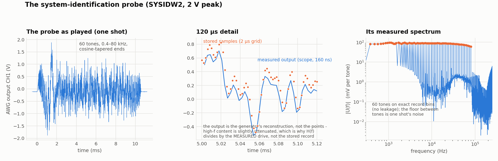

***The wide probe as actually played (measured, not synthetic).** Left: one
shot of the 2 V record. Middle: a 120 µs detail — the stored 2 µs samples
(dots) against the generator's reconstructed output (line). At the 80 kHz top
tone the stored grid holds 6.25 samples per cycle — comfortably above the
Nyquist requirement of 2, so the sampled cosines are exact in the sampled-data
sense — and the scope records at 160 ns (12.5 samples per cycle). The visible
difference between dots and line is the generator's reconstruction attenuating
the fastest content, which is precisely why H(f) = Y(f)/U(f) is formed from the
scope's *measured* drive channel rather than the stored record: any drive-side
rolloff, of the DAC or the probe hardware, cancels in the ratio. Right: the
measured spectrum — 60 clean tones on their bins, ~90 mV each, with the
between-tone floor set by one shot's noise.*

Sixty-four shots are captured per probe; H(fᵢ) is the shot-averaged ratio
Y(fᵢ)/U(fᵢ) with a per-tone coherence computed from the shot-to-shot scatter.
Tones below 0.9 coherence are discarded (in practice, none were — the wide
probes were coherent at every tone on both channels).

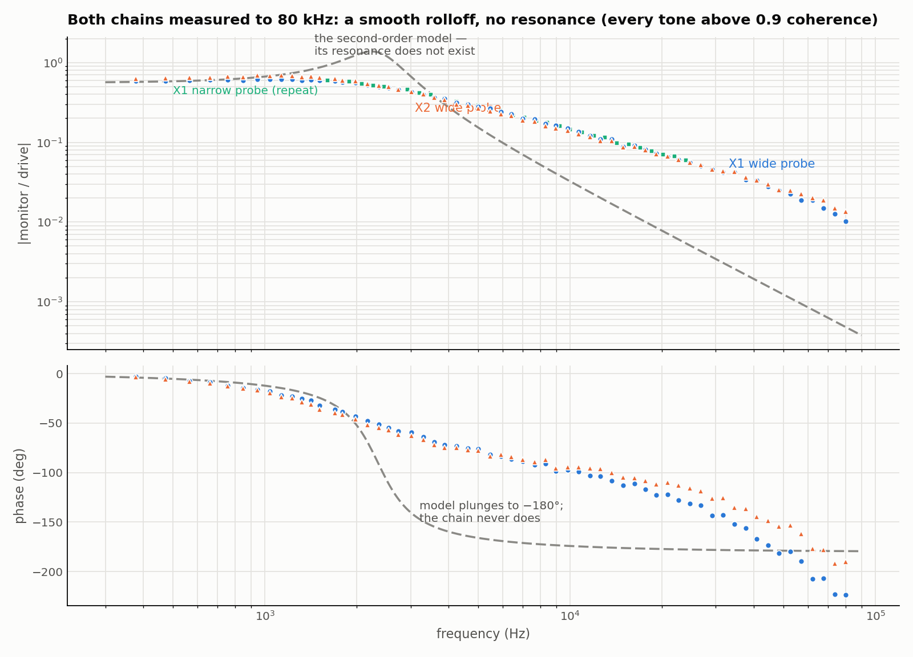

***The pivotal measurement.** Both chains, probed to 80 kHz at 2 V: a smooth,
gentle rolloff with phase easing to ~−140°. The second-order resonance — the
premise of the whole parametric approach — is absent at this probe level. The
ringing that the original ramp fits turned into a ζ ≈ 0.21 peak was a
large-signal phenomenon, observed in fast edges near the Trek's slew limit, and
the chain is measurably amplitude-dependent (§ below); at the levels the probe
reaches, the model's peak and −180° phase plunge simply are not in the data —
and they are exactly the features that made the parametric loop diverge above
5 kHz. The two chains are near-twins, and a repeat of X1's narrow probe agrees
with the wide one to 1.2%.*

### Applying it to the iteration

The parametric lead is replaced by division in the frequency domain:

$$
u_{k+1} = u_k + \gamma\,\mathrm{IFFT}\!\left[\,T(f)\,E_k(f)\,/\,H(f)\,\right] \qquad \text{(measured-inverse update)}
$$

- **H(f)** — the measured response, interpolated between tones (log-magnitude
  and unwrapped phase, linear in log f).
- **T(f)** — a raised-cosine taper: unity through the trusted band, falling to
  zero between f_use and f_max (finally 50→75 kHz), so the correction never
  acts where nothing was measured.

Convergence now depends on |1 − γ·T·H_true/H_meas|. The chain is measurably
nonlinear in amplitude — H probed at 6 V is 0.6–0.8× the 2 V measurement with
~30° phase shifts at 1–2 kHz — so no single H is exact at operating amplitude.
But a ratio of 0.6–0.8 keeps the bracket well inside 1, and on the bench the
loop contracted everywhere the taper was open.

Two integration lessons cost bench time and are worth recording. First, the
error handed to the measured inverse must span the *whole* measured band: the
first implementation reused the parametric path's 5 kHz pre-filter, so the
inverse only ever saw sub-5 kHz error, and a perfectly repeatable (r = +0.99)
2 V rms residual sat untouched at 5–15 kHz — inside the supposedly corrected
band. Second, the taper edge deserves respect: the inverse boost 1/|H| reaches
~100× at 80 kHz, so the correction was run at full strength only to 50 kHz on
first attempts.

### Would the one-pole model have worked?

A fair question, since the measured response has no resonance: was the
abandoned one-pole model right all along? The measurement answers no — it
removed the resonant *peak*, but it did not crown the single pole. At the
pole's own corner (5.7 kHz) the measured chain already lags 82° where a single
pole can produce at most 45° there and never more than 90°; by 24 kHz the chain
is at −131° and rolling off 2.4× faster than the one-pole predicts. No choice
of τ fixes this — phase beyond −90° is unreachable for the form. The chain
behaves like several distributed poles plus delay, and matching it
parametrically would mean fitting two or three poles and a delay to the FRF, at
which point one may as well divide by the FRF itself.

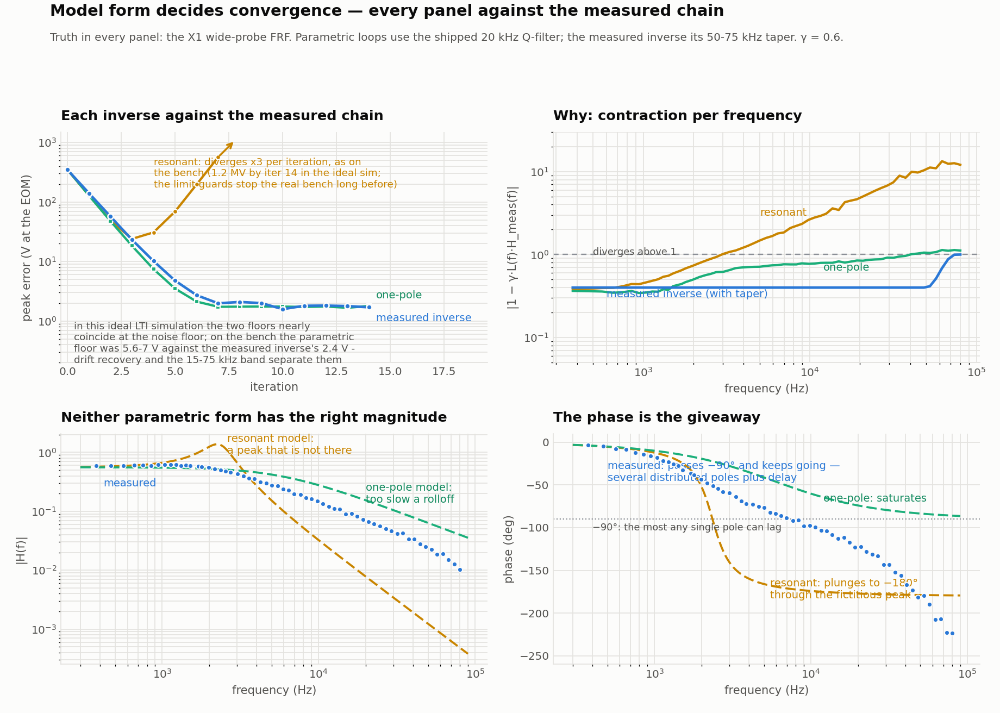

***All three inverses judged against the measured chain.** Every panel uses the
wide-probe FRF as the truth, so nothing here rests on the discredited
resonance. The resonant inverse diverges ×3 per iteration — reproducing the
bench; the one-pole inverse converges, because the 20 kHz Q-filter masks its
unstable region above 30 kHz; the measured inverse contracts uniformly. Bottom
row: neither parametric form has the right magnitude, and the phase is decisive
— the measured chain passes −90°, which no single pole can do, while the
resonant model plunges to −180° through a peak the probe does not see.*

Quantitatively, the per-band contraction factor |1 − γ·L·H_meas| (worst tone
per band):

| band | one-pole | resonant | measured inverse |
|:---|---:|---:|---:|
| 0.3–2 kHz | 0.50 | 0.73 | ≈0.4 |
| 2–6 kHz | 0.74 | 1.67 — diverges | ≈0.4 |
| 6–15 kHz | 0.83 | 3.61 | ≈0.4 |
| 15–30 kHz | 0.92 | 6.78 | ≈0.4 |
| 30–80 kHz | 1.14 — diverges | 13.3 | ≈0.4–0.5 |

So the one-pole would have been far less bad than the resonant model: it
converges the bulk, and even the 3–6 kHz band that stalled the campaign
contracts at 0.74 per iteration. But at 0.83–0.92 in the mid bands it needs
13–28 iterations per decade of error where the measured inverse needs 2.5; it
mildly diverges at 30–80 kHz (contained only by the Q-filter, at the cost of
never correcting there); and in an ideal simulation its floor nearly matches
the measured inverse's only because the simulation lacks the drift and the
15–75 kHz content that separated the two floors on the real bench (7 V
parametric versus 2.4 V measured-inverse).

Historically the one-pole was rejected before any bench iteration ran — by
simulation against the day-3 resonant fits, then believed. Given the
information held, that rejection was correct; against a genuinely resonant
plant a one-pole loop does diverge. The actual error sat one level up: **both
parametric forms were children of the same characterization method** —
large-signal ramp fits taken near the Trek's slew limit — which extrapolated a
resonance to signal levels where the probe later found none. The one-pole τ was
that method's group-delay estimate, and group delay is the one thing the fits
got right. The FRF did not merely correct the model's parameters; it corrected
the characterization method.

## 6. Results

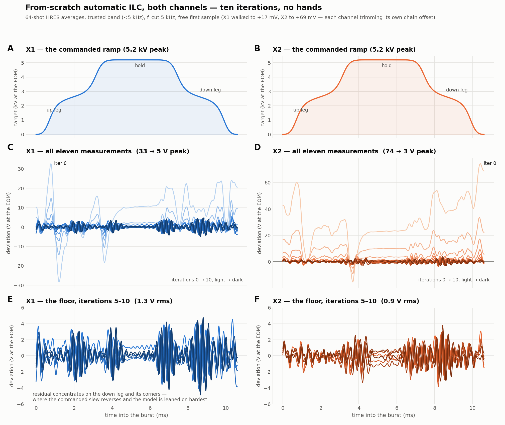

***The parametric era: from-scratch automated runs, both channels.** Ten
iterations, no hands. The trusted band converges at the theoretical rate to a
~7 V floor; the burst-entry transient (X2's stuck +40 V at t=0) was traced to
the chain idling off zero between bursts and cured by letting the loop set the
record's first sample freely within a ±100 mV safety cap — each channel then
trims its own chain offset (X1 walked to +17 mV, X2 to +69 mV, matching the
independently measured idle offsets).*

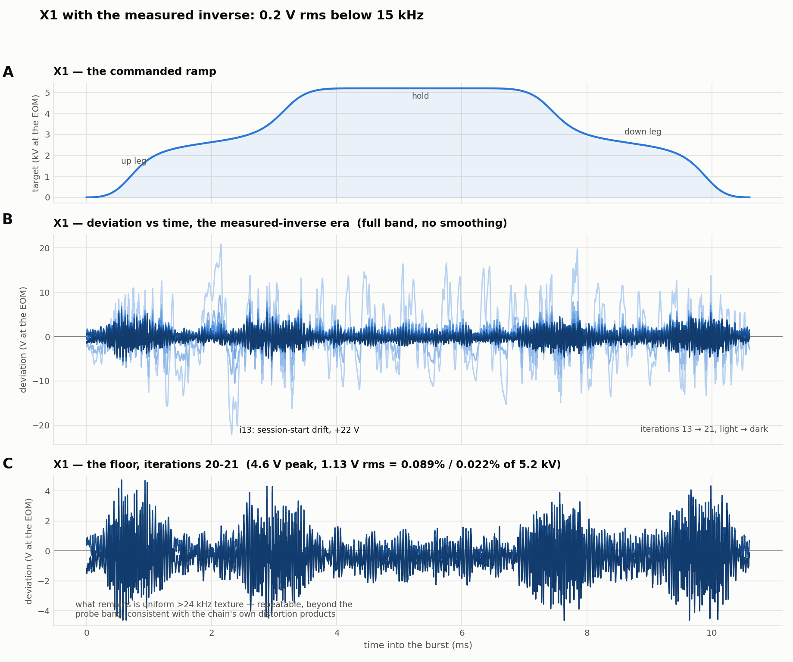

***The measured-inverse era (X1 shown).** A session-start drift spike of +22 V
collapses within two iterations; the floor that remains is uniform
high-frequency texture with no corner structure, no wiggles, and no entry spike
— at this stage 0.2 V rms below 15 kHz. Extending the inverse to 75 kHz then
claimed most of what this panel still shows.*

The accounting at the end of the campaign, 64-shot measurements, both channels
at the last iteration of their extended-band runs. "End of campaign" is not
"converged": the 50–80 kHz band was still shrinking when the bench time ran
out, and the open threads in §7 would move these numbers.

| band | X1 (iter 26) | X2 (iter 18) | status |
|:---|---:|---:|:---|
| < 24 kHz rms | 0.27 V | 0.19 V | measurement floor |
| 24–50 kHz rms | 0.12 V | 0.13 V | corrected by the wide inverse |
| 50–80 kHz rms | 0.32 V | 0.18 V | taper region, still shrinking |
| > 80 kHz rms | 0.16 V | 0.09 V | beyond the probe — uncorrected |
| **total rms** | **0.48 V** | **0.33 V** | **0.009% / 0.006%** |
| **total peak** | **2.4 V** | **2.4 V** | **0.046% of 5.2 kV** |

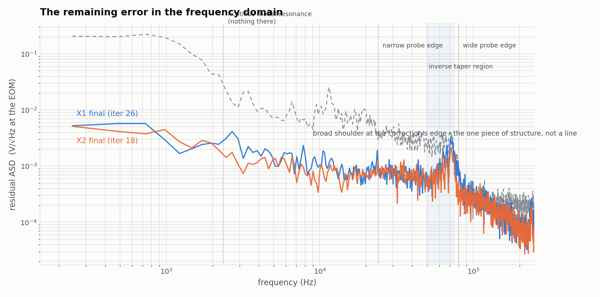

***The remaining error, spectrally.** Amplitude spectral density of each
channel's final residual against X1's pre-correction error. Nothing sits at the
old model's resonance location; there are no narrow lines anywhere — the only
structure is a broad shoulder where the correction tapers off (50–75 kHz)
against content just beyond it. Mains harmonics cannot be resolved within a
10.6 ms record (94 Hz bin spacing), but the 64 shots span minutes, so
incoherent mains pickup averages into the broadband floor rather than aliasing
to a line. The practical consequence: the residual offers no narrow drive line
for a future resonance of the optical system to sit on — though the broadband
floor itself still excites every band at the ~0.1 V scale.*

One hypothesis about the residual also fell to measurement: the ">24 kHz
distortion" story was mostly wrong. The 80 kHz probe showed that band to be
largely unmeasured *linear* response, which the extended inverse then corrected
— the genuinely nonlinear remainder is the ~0.1 V rms above 80 kHz.

### The session-start drift, decomposed

The chain **drifts on hour scales**: a converged drive re-measures 15–30 V off
at the start of each new session, and two or three warm-up iterations recover
it. The natural suspects — the idle offset error, a gain shift, a timing change
— are all measurable, so each drift event was decomposed as
d(t) ≈ a + b·v\*(t) + c·v̇\*(t) + shape(t), where a is an offset, b a gain
change, and c an effective delay:

| event | total drift pk | offset a | gain at pk | delay c | shape remainder |
|:---|---:|---:|---:|---:|---:|
| X1, second session start | 19.0 V | −1.3 V | +1.5 V | ≈0 | **18.5 V pk** |
| X1, third session start | 29.8 V | −3.4 V | −0.4 V | −1.5 µs | **25.5 V pk** |
| X2, session start (mild) | 5.6 V | +0.9 V | −2.1 V | −1.35 µs | 3.3 V |

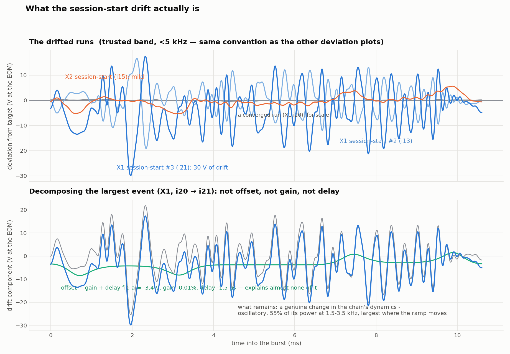

***The drift is none of the easy things.** Top: the drifted runs' deviations,
in the same convention as the other deviation plots, with a converged run in
gray for scale. Bottom: the largest event decomposed — the offset + gain +
delay fit (green) is a nearly flat few-volt line under a ±25 V signal. What
remains is a genuine change in the chain's transfer function: oscillatory, 55%
of its power at 1.5–3.5 kHz, largest wherever the ramp moves and near zero on
the hold — the same mid-band that moves with drive amplitude, here moving with
time and temperature instead. X2's mild event is the exception: it mostly *is*
a −1.35 µs delay drift.*

Two corollaries follow. The idle-offset trim and the drift are unrelated
problems — the freed first sample handles the standing offset, and only
re-iteration handles the drift. And in the three events decomposed, no
low-order per-session recalibration would have helped: the change lives in the
transfer function, not in any offset, gain, or delay, so the warm-up iterations
are the efficient fix available today. Killing the drift at the source would
mean characterizing the chain's FRF against temperature and warm-up time, not
its offsets.

## 7. The instrument, for the record

Half of the campaign was learning what the instruments actually do, as opposed
to what their manuals imply. The catalog, all established by direct
measurement:

| fact | consequence |
|:---|:---|
| AWG stores waveform names as `<name>.bin`, 15 chars max | a 16-char stored name plays correctly, then wedges the front panel until power-cycled; all tooling caps names at 11 |
| AWG holds the record's first sample between bursts | sample 0 sets the standing EOM voltage; the loop owns it (±100 mV cap) and self-trims the chain's idle offsets |
| AWG zero code ≠ zero volts (−12/−40 mV at 20 Vpp) | a file-zero first sample still parked the EOMs at −9/−41 V; hence the free first sample |
| scope `:SINGle` takes one hit of an average | "256-average" captures were single 8-bit shots; the first ILC iteration learned pure quantization grass |
| free-running average is exponential; its counter reports the setting | no honest progress readout under RUN; `:DIGitize` is the only true block average |
| records not stopped by `:SINGle` refuse `RAW` readout | averaged records must be read in `MAXimum` mode (7680 points) |
| BYTE readback rounds the average to 8 bits | WORD readback recovers 16× resolution; a 12-bit lattice remains, dithered away by software-averaged HRES shots |
| the chain's response is amplitude-dependent and drifts hourly | probe near operating level; budget warm-up iterations every session |

Everything here — the loop (`run_ilc.py`, `ilc_bench.py`), the probe and fit
tools (`sysid_make.py`, `sysid_fit.py`), the calibration, the guards that make
the failure modes unrepeatable, and this history — lives in
[Weiss-Quantum-Computing/Trek-EOM-ILC](https://github.com/Weiss-Quantum-Computing/Trek-EOM-ILC).
The open threads, in order of payoff: a few more 50–80 kHz iterations on X1; a
probe past 80 kHz; and characterizing the thermal drift at its source.

---

*Prepared 25 August 2026 from the campaign's bench data (`scope_data/EOM ramps
day 4`, states and measurements in `EOM-ILC/run`). All errors quoted in volts
at the EOM; all measurements 64-shot software-averaged HRES captures unless
noted. Figure sources: `run/make_report_figs*.py`, `run/make_quant_fig.py`.
This file is the repository copy of the published report artifact; the figures
are the same PNGs, committed under `docs/figures/`.*
